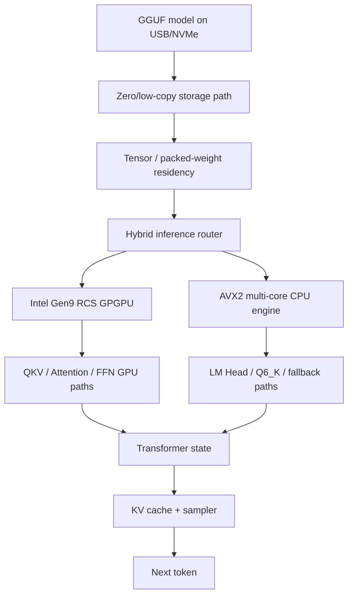

# AetherOS — Silicon Sovereign

> **Bare-metal AI operating system / inference unikernel for x86_64**  
> Direct Intel Gen9 GPGPU + AVX2 multi-core inference, built in Rust without Linux, libc, CUDA, OpenCL, Mesa, PyTorch, or a conventional user-mode driver stack in the default inference path.

**Current public documentation refresh:** 2026-08-18  
**Latest documented kernel:** `v0.3.0`  
**Codename:** **Silicon Sovereign**  
**Primary hardware:** Intel Core i3-10110U + Intel UHD 620 / Comet Lake GT2 (`8086:9B41`)  
**Peak verified clean 128-token E2E decode:** **~3.411 tokens/s (ROUND18EO)**  
**Latest hardware-observed architecture:** **ROUND18FB — Adaptive L2/L3 Cooperative Cache Tiling & Low-Latency GPU Dual-Walker**  
**Repository role:** public architecture, proof, validation methodology, performance history, and engineering showcase

---

## What AetherOS is

AetherOS is a Rust-first, `#![no_std]`, x86_64 bare-metal AI system built around one premise:

> **If inference is the workload, the operating system itself can become part of the inference engine.**

Instead of placing a model behind a conventional stack of application runtime, framework, user-mode GPU runtime, kernel driver, and general-purpose scheduler, AetherOS directly owns the path from boot to silicon.

```text
Traditional host stack

LLM application
    ↓
Python / framework
    ↓
BLAS / runtime / GPU API
    ↓
user-mode driver
    ↓
OS kernel
    ↓
hardware

AetherOS

GGUF / transformer graph
    ↓
AetherOS tensor + inference runtime
    ↓
raw AVX2 kernels / raw Gen9 command streams
    ↓
hardware
```

The project is not trying to become a general-purpose desktop operating system. It is an **AI-native research system** focused on deterministic execution, direct hardware control, aggressive observability, and real-silicon validation.

---

## Why this repository exists

The AetherOS core kernel and sensitive implementation material are maintained outside this public showcase. This repository is intentionally designed to expose the **engineering evidence** without publishing the entire private implementation surface.

This repository contains:

- the current public architecture;
- hardware target and boot/runtime design;
- Intel Gen9 GPGPU execution architecture;
- CPU AVX2 / AMP compute design;
- transformer and quantization runtime design;
- real-hardware proof matrix;
- benchmark progression and optimization lineage;
- correctness and promotion methodology;
- public/private IP boundary;
- contribution, security, citation, and repository governance documents.

For the authoritative public-facing technical index, start at [`docs/README.md`](docs/README.md).

---

## Current system snapshot

| Area | Current documented state |
|---|---|
| Kernel | `v0.3.0` — **Silicon Sovereign** |
| Architecture | x86_64 bare metal, Rust `#![no_std]` |
| Default execution model | Ring-0-first, no Linux/libc dependency in inference path |
| CPU | Intel Core i3-10110U, 2C/4T, AVX2 + FMA3 |
| GPU | Intel UHD 620 / Comet Lake GT2, Gen9, PCI `8086:9B41` |
| GPU path | Raw RCS + GGTT + GPGPU Walker command streams |
| Storage | xHCI USB mass storage + SCSI BOT + FAT/GGUF; NVMe stack present |
| Model milestone | LLaMA-3.2-1B-Instruct, ~1.23B parameters |
| Quantization | Q4_K_M / Q6_K primary validated paths; additional GGML formats supported in runtime |
| SMP/AMP | Core 0 system/UI, Core 1 inference master, Cores 2–3 neural workers |
| Peak verified E2E decode | **~3.411 TPS — ROUND18EO** (37.523738 s / 128 tokens) |
| Latest architecture | **ROUND18FB** |
| Latest clean 128-token decode | **~3.271 TPS — ROUND18FB best full request** (39.134811 s) |
| Q4 traffic metric | **~3.50–3.52 GB/s logical graph throughput** — explicitly not physical DRAM bandwidth |
| Public repository | architecture + proof showcase, not the complete private kernel source |

---

## Performance and architecture lineage

The old public showcase reflected an early ~`78.36B cycles/token` milestone. The supplied evidence now reaches ROUND18FB, but **latest architecture and peak benchmark are different states**.

| Milestone | Main architectural step | Clean 128-token evidence | Public interpretation |
|---|---|---:|---|
| v1.2 | early hybrid dispatch | ~78.36B cycles/token | historical |
| ROUND18EO | universal Q4_K 2OW packed | **37.523738 s / 586.31M avg cycles/token** | **peak supplied E2E: ~3.411 TPS** |
| ROUND18EW | zero-spill AVX2 Q6_K + packed QKV | ~39.21–40.07 s | later consolidated architecture |
| ROUND18EY | immediate multi-core Q6 + unified FFN | ~1.13B cycles/token | correctness-clean but major performance regression |
| ROUND18FA | cooperative cache tiling | 3 clean 128-token gates | recovered ~0.61–0.66B cycles/token class |
| **ROUND18FB** | **adaptive L2/L3 cooperative cache tiling + low-latency dual-walker** | **39.134811 s best full request / 611.48M avg cycles/token** | **latest observed architecture (~3.271 TPS best full request)** |

The ~`3.50–3.52 GB/s` values in recent logs are **logical Q4 graph-traffic throughput**, explicitly tagged `LOGICAL_GRAPH_TRAFFIC_NOT_PHYSICAL_DRAM`; they are not direct physical-memory-bandwidth measurements.

See [`docs/08-performance.md`](docs/08-performance.md), [`docs/14-development-lineage.md`](docs/14-development-lineage.md), and [`docs/18-latest-hardware-state.md`](docs/18-latest-hardware-state.md).

---

## The compute architecture



### Intel Gen9 GPU path

AetherOS directly programs the Intel Render Command Streamer:

```text
PIPELINE_SELECT
  → STATE_BASE_ADDRESS
  → MEDIA_VFE_STATE
  → MEDIA_INTERFACE_DESCRIPTOR_LOAD
  → GPGPU_WALKER
  → MEDIA_STATE_FLUSH
  → PIPE_CONTROL / fence
```

Current documented optimized paths include:

- **QKV triple-walker** — `2.67M cycles/layer`, bit-exact qualification;
- **FFN Gate + Up dual-walker** — `10.71M cycles/pair`, bit-exact qualification;
- **FFN Down 2OW** — `9.05M cycles/layer` at `2048×8192`;
- **Attention output 2OW** — `2.40M cycles/layer`;
- **Latest GGTT static-model evidence** — 147 model entries / 195,426 pages explicitly locked in ROUND18FB; the older 260,000-page figure is retained only as an earlier residency-policy threshold.

Deep dive: [`docs/05-gen9-gpu-compute.md`](docs/05-gen9-gpu-compute.md).

### CPU / AMP path

AetherOS treats the CPU cores as specialized inference resources rather than interchangeable scheduler targets:

```text
Core 0  → system orchestration, compositor, I/O
Core 1  → inference master, graph traversal, tokenizer, embeddings
Core 2  → neural worker, AVX2 kernels
Core 3  → neural worker, AVX2 kernels
```

The Q6_K path uses a dual-row AVX2 design with an 8-accumulator YMM budget intended to keep the hot dot-product path in registers and avoid stack spilling.

Deep dive: [`docs/06-cpu-amp.md`](docs/06-cpu-amp.md).

---

## Transformer runtime

The current primary model target is LLaMA-3.2-1B-Instruct:

- ~1.23B parameters;
- model dimension `2048`;
- 16 transformer layers;
- 32 attention heads;
- 8 KV heads (GQA);
- FFN dimension `8192`;
- vocabulary `128,256`;
- RoPE theta `500,000`;
- RMSNorm + SwiGLU;
- Q4_K_M / Q6_K optimized execution paths.

Prompt prefill avoids the full vocabulary projection on intermediate prompt tokens, performing the expensive LM Head only when it is semantically needed for token production.

Deep dive: [`docs/07-transformer-runtime.md`](docs/07-transformer-runtime.md).

---

## Real-hardware proof matrix

AetherOS uses explicit evidence classes. “Implemented” is not automatically “verified,” and “verified” is not automatically “production-promoted.”

| Capability | Evidence class |
|---|---|
| Limine boot + memory map | **HW-VERIFIED** |
| xHCI USB mass storage | **HW-VERIFIED** |
| GGUF V3 model ingestion | **HW-VERIFIED** |
| Intel Gen9 RCS/GPGPU execution | **HW-VERIFIED** |
| Q4_K 2OW packed kernels | **HW-VERIFIED** |
| QKV triple-walker | **HW-VERIFIED / bit-exact** |
| FFN Gate+Up dual-walker | **HW-VERIFIED / bit-exact** |
| FFN Down 2OW | **HW-VERIFIED / bit-exact** |
| Zero-flush GGTT residency | **HW-VERIFIED** |
| CPU Q6_K AVX2 dual-row | **HW-VERIFIED / bit-exact** |
| End-to-end chat generation | **HW-VERIFIED — peak ~3.411 TPS in ROUND18EO; latest architecture ROUND18FB** |

The proof model and promotion rules are documented in [`docs/09-proof-matrix.md`](docs/09-proof-matrix.md) and [`docs/10-validation-methodology.md`](docs/10-validation-methodology.md).

---

## Documentation map

| Document | Purpose |
|---|---|
| [`docs/00-project-identity.md`](docs/00-project-identity.md) | identity, scope, principles, non-goals |
| [`docs/01-architecture.md`](docs/01-architecture.md) | complete system architecture |
| [`docs/02-hardware-platform.md`](docs/02-hardware-platform.md) | physical target and PCI devices |
| [`docs/03-boot-memory-runtime.md`](docs/03-boot-memory-runtime.md) | boot, memory, SMP, interrupts, runtime |
| [`docs/04-io-storage.md`](docs/04-io-storage.md) | PCI, NEXUS, xHCI, NVMe, FAT/GGUF ingestion |
| [`docs/05-gen9-gpu-compute.md`](docs/05-gen9-gpu-compute.md) | raw Intel Gen9 compute architecture |
| [`docs/06-cpu-amp.md`](docs/06-cpu-amp.md) | AVX2 and asymmetric multiprocessing |
| [`docs/07-transformer-runtime.md`](docs/07-transformer-runtime.md) | GGUF, transformer, quantization, KV cache |
| [`docs/08-performance.md`](docs/08-performance.md) | current benchmarks and bottlenecks |
| [`docs/09-proof-matrix.md`](docs/09-proof-matrix.md) | verified / qualified / experimental matrix |
| [`docs/10-validation-methodology.md`](docs/10-validation-methodology.md) | bit-exact gates, telemetry, promotion policy |
| [`docs/11-ui-compositor.md`](docs/11-ui-compositor.md) | compositor, Obsidian/Atticus, system labs |
| [`docs/12-security-determinism.md`](docs/12-security-determinism.md) | SSP, KASLR-lite, determinism, isolation |
| [`docs/13-debug-telemetry.md`](docs/13-debug-telemetry.md) | serial telemetry and forensic observability |
| [`docs/14-development-lineage.md`](docs/14-development-lineage.md) | optimization rounds and architectural evolution |
| [`docs/15-public-private-boundary.md`](docs/15-public-private-boundary.md) | what is and is not published |
| [`docs/16-glossary.md`](docs/16-glossary.md) | project terminology |
| [`docs/17-faq.md`](docs/17-faq.md) | technical FAQ |
| [`docs/99-complete-system-reference.md`](docs/99-complete-system-reference.md) | consolidated long-form reference |

---

## Design principles

### 1. Direct silicon ownership

AetherOS prefers explicit ownership of registers, queues, page tables, rings, DMA structures, synchronization and memory residency over opaque runtime layers.

### 2. Deterministic execution

Inference performance is measured in a controlled environment with minimized scheduling and allocation noise.

### 3. Correctness before promotion

Optimization candidates are expected to prove numerical parity before becoming production execution paths.

### 4. Observability is architecture

Serial telemetry, cycle counters, fences, qualification counters and recovery state are not temporary debug code. They are part of how the system is engineered.

### 5. Public claims follow evidence

The project distinguishes:

- **implemented**;
- **boot-tested**;
- **hardware-verified**;
- **bit-exact qualified**;
- **shadow candidate**;
- **production-promoted**.

That distinction is intentional and should be preserved in issues, pull requests and external descriptions.

---

## Repository status and source availability

This is a **showcase / documentation repository**, not the complete AetherOS source tree. The absence of kernel source here should not be interpreted as absence of implementation; conversely, architectural documentation should not be treated as a promise that every experimental path is production-promoted.

See [`docs/15-public-private-boundary.md`](docs/15-public-private-boundary.md) and [`NOTICE.md`](NOTICE.md).

---

## Contributing, security and research contact

- Contribution policy: [`CONTRIBUTING.md`](CONTRIBUTING.md)
- Security policy: [`SECURITY.md`](SECURITY.md)
- Support / questions: [`SUPPORT.md`](SUPPORT.md)
- Code of conduct: [`CODE_OF_CONDUCT.md`](CODE_OF_CONDUCT.md)
- Citation metadata: [`CITATION.cff`](CITATION.cff)

Because this is a public showcase for a partially private research system, contributions are primarily useful in documentation quality, reproducibility review, architecture critique, benchmark methodology, typo corrections and research discussion.

---

## Citation

If you reference AetherOS in research, technical writing, presentations or comparative systems work, use the repository citation metadata in [`CITATION.cff`](CITATION.cff).

---

## Legal / licensing note

No open-source license is granted for the private AetherOS kernel or unpublished implementation by virtue of this repository. Public documentation and repository content remain subject to the terms in [`LICENSE.md`](LICENSE.md) and [`NOTICE.md`](NOTICE.md).

---

**AetherOS — Silicon Sovereign**  
*Boot to model. Model to silicon. Evidence before claims.*
