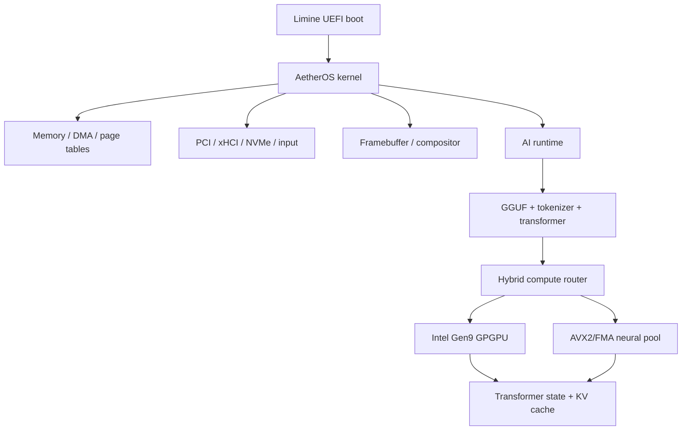

# System Architecture

## High-level composition

AetherOS integrates boot, kernel services, device drivers, AI runtime and hardware compute into one bare-metal system image.



## Architectural layers

### Boot and machine ownership
Limine provides the initial memory map, framebuffer, HHDM and SMP entry points. AetherOS then configures CPU state, descriptor tables, interrupts, memory allocators and device discovery.

### Kernel services
The system includes physical/virtual memory management, DMA allocation, interrupt control, scheduler scaffolding, telemetry and a framebuffer compositor.

### Device and storage fabric
The NEXUS device manager identifies and initializes target hardware. Model ingestion is available through xHCI USB mass storage and FAT/GGUF parsing; NVMe support is also present.

### AI runtime
The runtime contains GGUF parsing, tokenization, transformer execution, quantized kernels, KV cache management, CPU/GPU routing and inference telemetry.

### Compute fabric
The current system uses two complementary compute planes:

- Intel Gen9 RCS/GPGPU for selected Q4_K projection and FFN paths;
- AVX2/FMA multi-core CPU kernels for Q6_K, LM Head and fallback execution.

## Why a hybrid architecture

The target iGPU is not assumed to be optimal for every operation. AetherOS therefore routes work based on measured execution characteristics rather than forcing all inference onto one device.

The architecture is designed around:

- operator shape;
- quantization format;
- memory bandwidth;
- residency state;
- synchronization cost;
- correctness qualification;
- available CPU core roles.

## Runtime data movement

```text
Storage
  ↓
xHCI/NVMe DMA
  ↓
GGUF-backed tensor representation
  ↓
packing / residency when required
  ↓
CPU AVX2 or GPU-visible GGTT mapping
  ↓
operator execution
  ↓
activation / KV / next layer
```

The phrase “zero-copy” in AetherOS should be read precisely: the architecture avoids unnecessary framework/user-kernel/runtime copies and uses direct DMA or memory-backed tensor views where possible. Some optimized GPU layouts require deliberate packing/reformatting because execution layout itself is part of the optimization.
